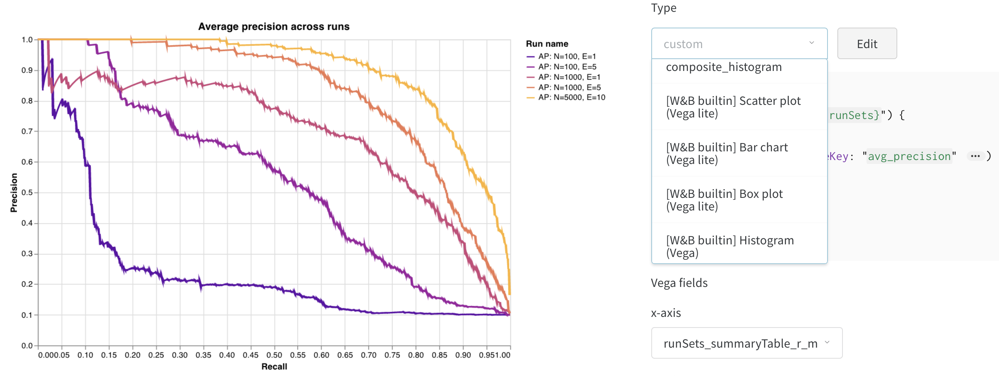
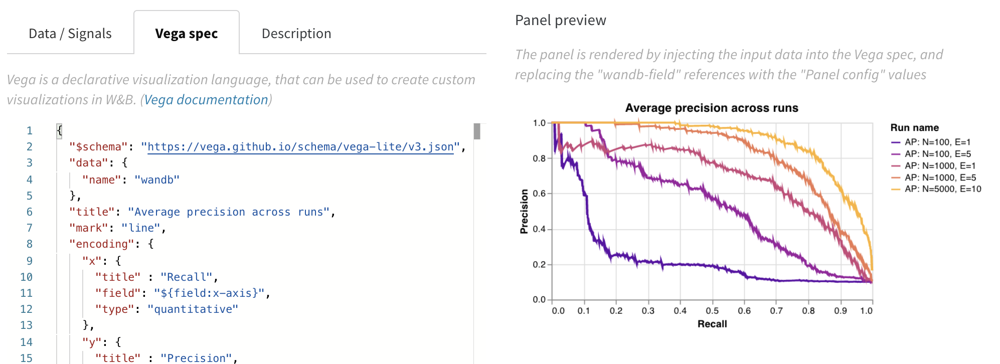

# Custom Charts \[Beta\]

Create custom charts to visualize your experiment data. This new beta feature allows you to fetch any of the data you've logged in a run and customize both the query used to filter and format that data and the visualization used to display it.

[Try it in a Google Colab →](http://bit.ly/custom-charts-colab)

[See live example charts →](https://app.wandb.ai/demo-team/custom-charts/reports/Custom-Charts--VmlldzoyMTk5MDc)

Contact **carey@wandb.com** with questions or suggestions.

### How it works

1. **Log data**: From your script, log [config](../../../library/config.md) and summary data as you normally would when running with W&B. To visualize a list of multiple values logged at one specific time, use a custom`wandb.Table`
2. **Custom queries**: Pull in any of this logged data with a [GraphQL](https://graphql.org/) query.
3. **Custom visualizations**: Visualize the results of your query with [Vega](https://vega.github.io/vega/), a powerful visualization grammar. 


## Log data

The first step is to get the experiment data you'd like to visualize into Weights & Biases. Any existing experiment logging via `wandb.config`or summary \(single values logged to a named key with `wandb.log`\) will be available to the query. You can also query the full history of summary values logged to a single key. You don't need to make any changes to your existing wandb code to fetch any of this data into a custom chart. To visualize a list of values logged at one point in time, we recommend adding a custom `wandb.Table`.

### **Logged data types available for custom charts**

* **Config**: Initial settings of your experiment \(your independent variables\). This includes any named fields you've logged as keys to `wandb.config` at the start of your training \(e.g. `wandb.config.learning_rate = 0.0001)`
* **Summary**: Single values logged during training \(your results or dependent variables\), e.g. `wandb.log({"val_acc" : 0.8})`. If you write to this key multiple times during training via `wandb.log()`, the summary is set to the final value of that key 
* **History**:  The full history of the logged key is available to the query via the `history` field
* **summaryTable**: If you need to log a list of multiple values, use a `wandb.Table()` to save that data, then query it in your custom panel.

First, log data in your script. [Try a quick example notebook](https://bit.ly/custom-charts-colab) to log the data tables, and see example results in this live W&B[ report](https://app.wandb.ai/demo-team/custom-charts/reports/Custom-Charts--VmlldzoyMTk5MDc).

* Use [wandb.config](../../../library/config.md) for single points set at the beginning of training, like hyperparameters. 
* Use [wandb.log\(\)](../../../library/log.md) for multiple points over time, and custom tables \(see the next section\)

### **How to log a custom table**

Use `wandb.Table()` to log your data as a  2D array. Typically each row of this table represents one data point, and each column denotes the relevant fields/dimensions for each data point which you'd like to plot. As you configure a custom panel, the whole table will be accessible via the named key passed to `wandb.log()`\("custom\_data\_table" below\), and the individual fields will be accessible via the column names \("x", "y", and "z"\). You can log tables at multiple time steps throughout your experiment. The maximum size of each table is 10,000 rows. 

[Try it in a Google Colab →](http://bit.ly/custom-charts-colab)

```python
# Logging a custom table of data
my_custom_data = [[x1, y1, z1], [x2, y2, z2]]
wandb.log({“custom_data_table”: wandb.Table(data=my_custom_data,
                                columns = ["x", "y", "z"])})
```

## Custom queries

Add a new custom chart to get started, then edit the query to select data from your visible runs. The query uses [GraphQL](https://graphql.org/) to fetch data from the config, summary, and history fields in your runs.


## Custom visualizations

Select a **Type** of visualization to switch between the built-ins: scatter plot, bar chart, box plot, histogram, violin plot, and contour plot. 

Select **Vega fields**  to map the data you're pulling in from the query to the corresponding fields in your chart. 

* For a built-in bar chart, you could set the Vega field `value` to show "loss" \(displayed as`runSets_summary_loss`\) to see your final training loss across multiple runs. 
* For the custom chart below, the experimental data for average precision is represented as a series of coordinate points of \(recall, precision\). These are logged to a custom `wandb.Table` under the key `"avg_precision"`, available to the query as a `summaryTable`. Map the Vega field `x-axis` to the recall, or `"r_m"` field, and the Vega field `y-axis` to the precision or `"p_m"` field \(not shown\) to display the average precision curves on this chart.

[See live example charts →](https://app.wandb.ai/demo-team/custom-charts/reports/Custom-Charts--VmlldzoyMTk5MDc)



### Editing Vega

Click **Edit** at the top of the panel to go into [Vega](https://vega.github.io/vega/) edit mode. Here you can define a [Vega specification](https://vega.github.io/vega/docs/specification/) that creates an interactive chart in the UI.  You can change any aspect of the chart, from the visual style \(e.g. change the title, pick a different color scheme, show curves as a series of points instead of as connected lines\) to the data itself \(use a Vega transform to bin an array of values into a histogram, etc.\). The panel preview will update interactively, so you can see the effect of your changes as you edit the Vega spec or query. The [Vega documentation and tutorials ](https://vega.github.io/vega/)are an excellent source of inspiration.

**Field references**

To pull data into your chart from W&B, add template strings of the form `"${field:<field-name>}"` anywhere in your Vega spec. This will create a dropdown in the **Chart Fields** area on the right side, which users can use to select a query result column to map into Vega.



You can also use the **Data / Signals** tab to debug. This shows you the tables and formats that are available to you in the Vega view, coming in from the query.

### Saving Charts

Apply any changes to a specific visualization panel, or save the Vega spec to reuse elsewhere in your project. To save the reusable chart definition, click **Save as** at the top of the Vega editor and give your preset a name. 

## Frequently asked questions

### Coming soon

* **Run colors**: Matching the colors in the custom charts to the run colors set in the sidebar
* **Custom user-defined fields**: Adding custom string fields outside of the Vega spec \(like chart titles\)
* **wandb.plot\(\)**: Call from Python to log custom visualizations
* **Polling**: Auto-refresh of data in the chart
* **Sampling**: Dynamically adjust the total number of points loaded into the panel for efficiency
* **Save templates**: Use a Vega chart across different projects without needing to manually copy and paste

### Gotchas

* Not seeing the data you're expecting in the query as you're editing your chart? It might be because the column you're looking for is not logged in the runs you have selected. Save your chart and go back out to the runs table, and select the runs you'd like to visualize with the **eye** icon.

### Common use cases

* Customize bar plots with error bars
* Show model validation metrics which require custom x-y coordinates \(like precision-recall curves\)
* Overlay data distributions from two different models/experiments as histograms
* Show changes in a metric via snapshots at multiple points during training
* Create a unique visualization not yet available in W&B \(and hopefully share it with the world\) 

